# LookForDoc

프로젝트 기간: 2022-10-11~ 2022-11-18

# 1.프로젝트 개요

## 1-1 프로젝트 주제

환자의 구체적인 신체 증상을 입력받아 분석 후 어느 진료과로 가야하는지 가이드라인을 제공하고 주변 병원의 위치와 정보를 제공하는 웹서비스 구현하였습니다.

해당 서비스 구현을 통해 몸이 불편한 환자들의 증상에 대해 빠르게 1차 가이드라인을 제공하고 기존 네이버 Q&A의 평균 답변률과 대기시간의 한계가 개선되는 것을 기대합니다.

## 1-2 웹서비스 기능 순서도

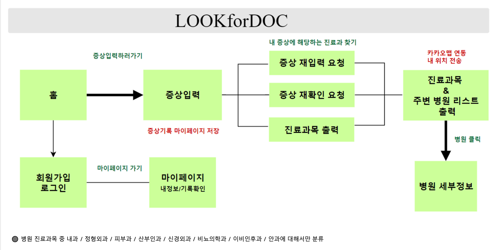

- 순서도는 위와 같으며, 서비스 주요 기능은 **증상입력 진료과목분류, 병원추천, 길찾기** 총 4가지입니다.

## 1-3 수집 데이터

- 수집 데이터 정보
    
    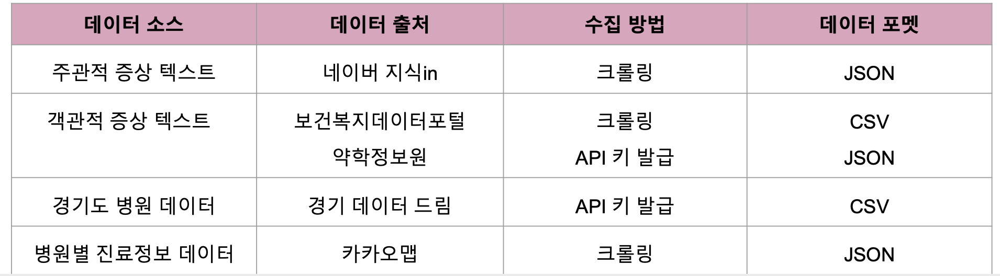
    

## 1-4 기술 스택

### DE (이선희 윤병우)

- **ETL 파이프라인**
    - Data Lake :Hadoop
    - Data Warehouse, Data Mart, Operate DB : Oracle ATP
    - 데이터 가공 및 분산처리엔진 : spark
    - 배치도구 : Airflow

### DS (홍석민 김승규 정서영)

- 맞춤법 교정:hanspell
- 형태소 분석: KoNLPy
- 피처 선정:TF-IDF
- 모델링 및 테스트:로지스틱스 회귀

### WEB SERVER

- Web Framework :Django,Django Rest framework
- 언어 :  HTML5,CSS,javascript
- front-end :Bootstrap

### Cowork tools

- Github: https://github.com/kaylee125/hospital
- Trello : [https://trello.com/b/8WzVce88/환자-증상별-진료과목-및-경기도내-병원-추천](https://trello.com/b/8WzVce88/%ED%99%98%EC%9E%90-%EC%A6%9D%EC%83%81%EB%B3%84-%EC%A7%84%EB%A3%8C%EA%B3%BC%EB%AA%A9-%EB%B0%8F-%EA%B2%BD%EA%B8%B0%EB%8F%84%EB%82%B4-%EB%B3%91%EC%9B%90-%EC%B6%94%EC%B2%9C)

## 1-5 Workflow

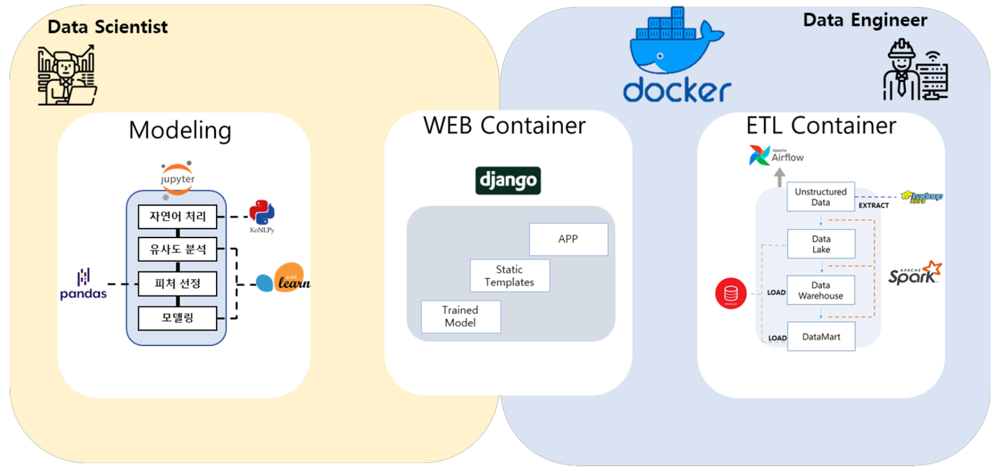
# 2. 프로젝트 수행 결과-데이터 파이프라인

## 2-1 데이터 전처리

1. 맞춤법 교정 :hanspell 맞춤법 교정기 사용
2. 중복된 답변은 제대로된 추천이 아니기 때문에 중복적으로 진료과를 추천하는 데이터는 삭제
1. 형태소 분석
- 중복된 진료과 데이터 삭제 후  진료과 별로 데이터 분리
- 한국어 처리를 위한 파이썬 패키지 KoNLPy에서 제공하는 형태소 분석기 Okt 라이브러리 사용 (Okt.pos : 품사 추출)
- 형태소 분석기를 이용해 증상 텍스트에서 명사**,** 동사**,** 형
용사만 추출
1. 불용어 제거
2. 어간추출 및 교정(Konlpy-okt.morphs)

## 2-2 Data Lake - Extract

- HDFS: Docker환경에서 HDFS를 띄워 Datalake로 사용함으로서 Raw Data를 추출해 안전하게 저장할 수 있는 환경을 구축했습니다.

## 2-3 Data Transform

- 추출한 Raw Data를 spark를 사용해 구축한 RDB 테이블에 맞게 가공했습니다.

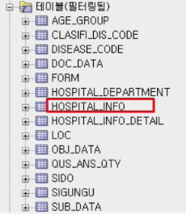
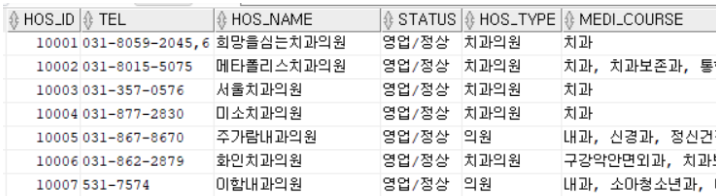

## 2-4 Data Warehouse

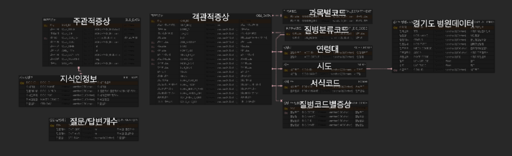

- ERD Cloud : [https://www.erdcloud.com/d/QDAzQR7T8xhNF2bbS](https://www.erdcloud.com/d/4m6hyKdGeWB5Rhkrd)
    
    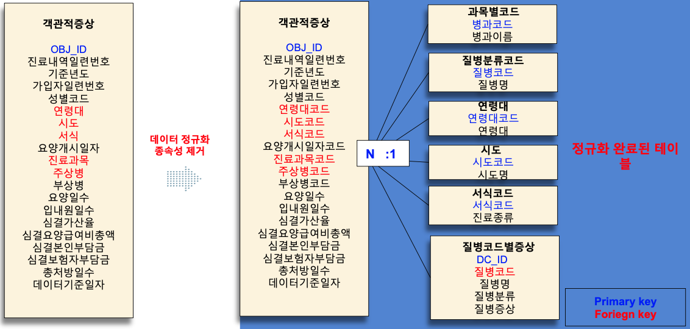
    
- 데이터 웨어하우스 테이블 설계 시 이상현상이 발생될 것으로 예상되는 테이블을 확인하여 3정규화까지 진행하며 설계했습니다.

## 2-5 DataMart

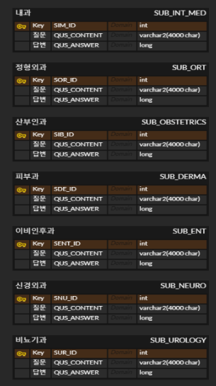

- Datawarhouse에서 총 23개의 진료과 중 8개의 과를 선정하여 해당 진료과만 분류하기로 결정했습니다.
- 이에 총 8개의 진료과의 과목별 증상 데이터를 Datamart에 적재했습니다.
- 이후 DS파트에서 Datamart의 각 진료과목별 증상 텍스트 데이터로 모델 훈련 진행했습니다.

## 2-6 Airflow

워크플로우 관리를 위해 airflow를 사용했습니다.

Airflow Dag 파일에서  bashoperator로 batch별 실행 시간을 지정하고 task 순서를 직렬 또는 병렬로 구성하였습니다.

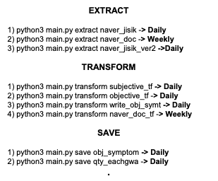

네이버 지식인 크롤링와 같이 양이 많고 빠른 업데이트가 필요한 데이터는 매일 밤 11:30분 마다 크롤링될 수 있도록 Daily로 처리하였고, 그 외의 Task는 주 1회 처리될 수 있도록 dag파일을 구성했습니다.

# 3. 프로젝트 수행 결과 -웹서비스

- 1.사용자의 증상을 입력할 수 있는 화면 구현

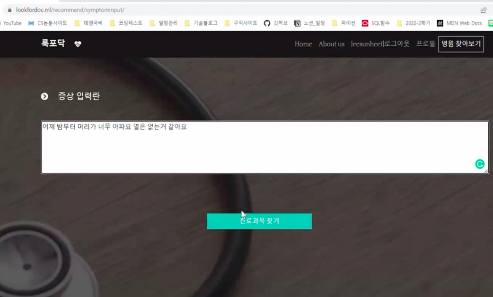

- 2.입력한 텍스트 데이터 내 데이터로 모델에 적용했을때 피처가 부족하여 결과가 나오지 않을 경우 해당 화면으로 이동
- 사용자에게 추가적인 선택지를 제공하여 재입력 요청

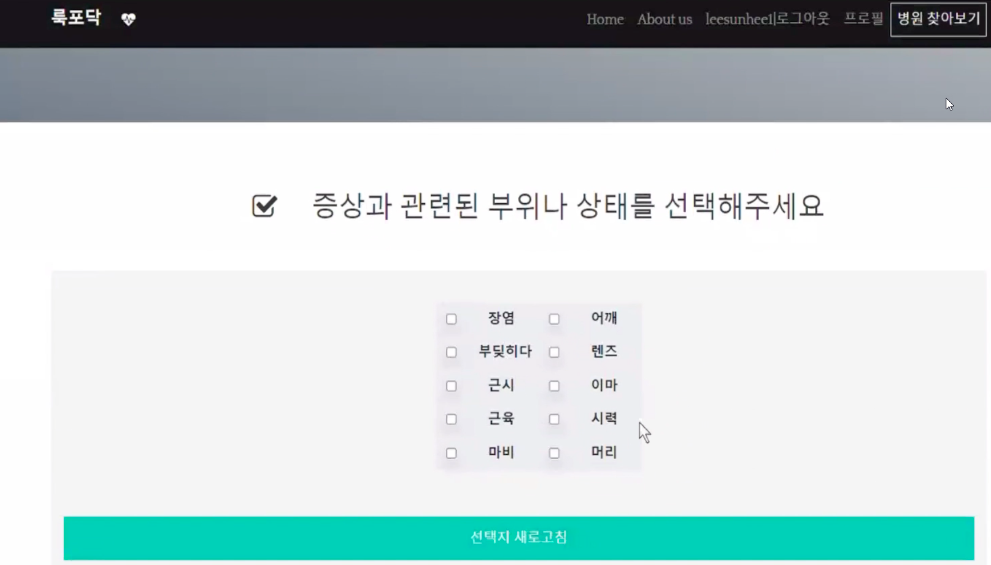

- 3.진료과 추천 화면 구현
- 입력한 증상에 따라 최종 진료과목을 추천
- 현재위치에서 가까운 병원리스트를  검색 가능

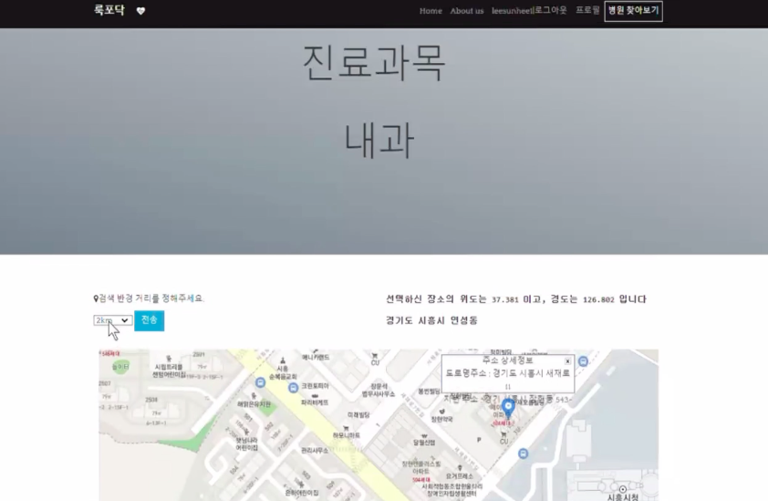

- 4.사용자 거리 중심으로 해당 진료과목의 진료를 보는 병원리스트를 제공
- 지도로 병원별 위치 제공

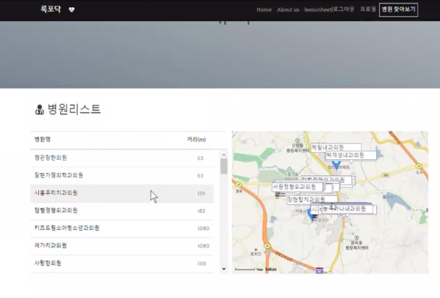

- 5.위 화면에서 특정병원을 클릭하면 세부 병원 정보로 이동
- 카카오맵 통해 크롤링한 병원 정보 데이터를 화면에서 보여주는 화면 구현

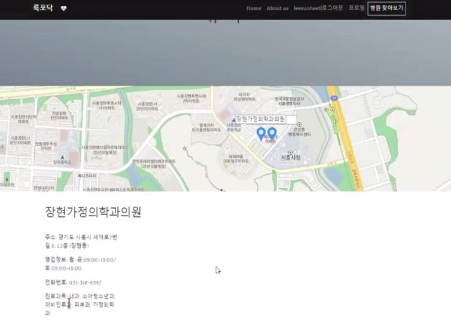

# 4. 개선사항

- 현재 경기도 병원데이터만 지원하고 있으나, DB 개선하여 전국 병원데이터로 서비스 범위 확대
- 운영 DB에 적재되는 데이터를 주기적으로 모델 훈련에 적용하여 모델 성능을 지속적으로 향상 시키고 신뢰성 확보
- 진료과목을 8개로 한정하지 않고 다양한 진료과목으로 확장
- 실시간 병원 정보를 사용할 수 있도록 업데이트
- 시스템 아키텍처의 결합도를 낮추기 위한 개선점 찾고 적용